# diagrammar

Polished, accessible, server-rendered SVG diagrams for the web.

<picture>
  <source media="(prefers-color-scheme: dark)" srcset="docs/examples/cloud.dark.svg">
  
</picture>

## What it is

diagrammar is a TypeScript library for drawing architecture, cloud, data-flow, and process diagrams. You list the boxes and the arrows between them. It works out where everything goes and gives you back one SVG.

```ts
const svg = await renderDiagram({
  nodes: [{ id: 'a', label: 'Client' }, { id: 'b', label: 'API', role: 'primary' }],
  edges: [{ id: 'e1', from: 'a', to: 'b' }],
});
```

Three things set it apart:

- **You describe it, it lays it out.** Positions, edge routing, and the size of groups come from [ELK](https://github.com/kieler/elkjs), a proper graph layout engine. You never drag a box. When you do want one in a fixed spot, you can pin it.
- **The output is a plain SVG string, made on the server.** It's in your HTML before any script runs, search engines and screen readers can read it, and there's no diagram code in the browser bundle. The same input gives byte-identical output, so a changed diagram shows up cleanly in a code review.
- **It's made for the web.** Light and dark modes, a high-contrast theme, a title, a description, and per-edge text for assistive technology, real links and tooltips on nodes, and optional hover highlighting when you want interaction.

You can write a diagram as plain data or as React components, and the result is the same. Groups nest, so a region containing a VPC containing subnets is just groups inside groups. There are built-in icons, a few bundled brand logos, and a way to import your own (including the AWS, Google Cloud, and Azure sets, which you download yourself).

It's a good fit for architecture docs, READMEs (GitHub shows these SVGs, light and dark), blog posts, and personal sites. It's not a drawing tool, an editor, or a charting library, and it's aimed at diagrams a person can read: tens of nodes, not thousands.

Status: early development. Schema, authoring, layout, static rendering, theming, icons and logos, and basic interaction work. Animation, swimlanes, ports, and PNG export are still ahead. See [the task list](openspec/changes/bootstrap-diagram-library/tasks.md).

## Install

```sh
npm install diagrammar
```

React is an optional peer dependency. You only need it for `diagrammar/react`.

## Draw with Claude Code

The package includes a [Claude Code](https://claude.com/claude-code) subagent that knows the schema, the layout and render options, the icon system, and how to embed a diagram in a site. Ask it for a diagram in plain words and it writes the definition, renders it, checks that it validates, and tells you where the files are.

Copy it into your project once:

```sh
mkdir -p .claude/agents
cp node_modules/diagrammar/.claude/agents/diagrammar.md .claude/agents/
```

To have it in every project, copy it to `~/.claude/agents/` instead. Then ask for what you want:

> Use the diagrammar agent to draw our checkout flow: the storefront calls the orders API, which writes to Postgres and publishes to a queue that billing and shipping both read.

The agent's instructions are in [.claude/agents/diagrammar.md](.claude/agents/diagrammar.md). Edit your copy to add your project's conventions, such as a preferred layout direction or where diagrams live.

## Use it

```ts
import { renderDiagram } from 'diagrammar/server';

const svg = await renderDiagram({
  nodes: [
    { id: 'a', label: 'Client' },
    { id: 'b', label: 'API', role: 'primary' },
  ],
  edges: [{ id: 'e1', from: 'a', to: 'b' }],
});
```

`svg` is a string. Write it to a file, inline it in HTML, or return it from a route. In React, `DiagramView` draws it and the markup is present in server-rendered HTML.

| Import | What it gives you |
| --- | --- |
| `diagrammar` | The schema, validation, and `defineDiagram()` |
| `diagrammar/react` | `<Diagram>`, `<Node>`, `<Edge>`, `<Group>`, `<Layer>`, `definitionFromElement()`, `DiagramView` |
| `diagrammar/interactive` | `InteractiveDiagram`: highlighting, pan and zoom, keyboard navigation, click callbacks (a client component) |
| `diagrammar/layout` | `layoutDiagram()` for automatic layout (bundles ELK) |
| `diagrammar/render` | `renderSvg()`, themes, icons, `iconFromSvg()`, `iconifyPack()`. No ELK, so it stays small |
| `diagrammar/server` | `renderDiagram()` and `renderPng()`: validate, lay out, and render in one call |
| `diagrammar/logos` | Bundled brand logos (GitHub, Snowflake, Terraform, PostgreSQL, and others) |
| `diagrammar/icons` | Concept icons for things with no logo: workspace, plan, apply, state file, queue |
| `diagrammar import mermaid` | A command that converts a Mermaid flowchart into a definition |
| `diagrammar icons import` | A command that turns a folder or zip of SVGs into an icon module |

To keep ELK out of your page bundle, compute the layout at build time and pass the saved result to `renderSvg()` or `DiagramView`.

## Export a file, or put it on a website

The same diagram works both ways.

**One SVG file per diagram.** `renderDiagram` returns a complete SVG string. Pass `background: true` so it has a solid backdrop and reads well when opened on its own. Pass `mode: 'light'` or `'dark'`, or leave it out and the SVG follows the viewer's setting.

```ts
import { writeFileSync } from 'node:fs';
import { renderDiagram } from 'diagrammar/server';

writeFileSync('architecture.svg', await renderDiagram(diagram, { background: true }));
```

**A PNG, for everywhere that isn't the web.** Slack, Google Docs, slides, and PDFs all want a raster image. `renderPng` returns the bytes.

```ts
import { renderPng } from 'diagrammar/server';

writeFileSync('architecture.png', await renderPng(diagram, { scale: 2, background: true }));
```

`scale: 2` doubles the pixel size for high-density screens. Leave `background` off for a transparent one. A PNG can't follow the viewer's light or dark setting, so pick one with `mode`; it defaults to light.

PNG export needs the optional `@resvg/resvg-js` package, which ships prebuilt binaries:

```sh
npm install @resvg/resvg-js
```

Text is drawn with the fonts on the machine doing the export, so a build server without your diagram font will substitute another. Pass `fontDirs` with `fontDirsOnly: true` to pin the fonts and get the same image everywhere.

**Inline on a page, with links.** Give a node an `href` and it becomes a real link. Give it `detail` and it gets a tooltip. `DiagramView` puts the SVG in your server-rendered HTML, so it shows up before any script runs.

```tsx
import { DiagramView } from 'diagrammar/react';
import { layoutDiagram } from 'diagrammar/layout';

const layout = await layoutDiagram(diagram); // at build time or on the server
<DiagramView diagram={diagram} layout={layout} />;
```

**Hover and click.** `InteractiveDiagram` takes the same props and adds highlighting: hover or focus a node and everything not connected to it dims. `onNodeClick` and `onNodeHover` let you open a side panel, filter a table, or whatever the page needs. It's a client component, so compute the layout on the server and pass it down as a prop.

```tsx
'use client';
import { InteractiveDiagram } from 'diagrammar/interactive';

<InteractiveDiagram diagram={diagram} layout={layout} onNodeClick={(node) => openPanel(node.id)} />;
```

**Pan and zoom.** Pass `zoom` and the reader gets zoom and fit controls. A big cloud diagram stays readable without the page having to be enormous.

```tsx
<InteractiveDiagram diagram={diagram} layout={layout} zoom minZoom={0.5} maxZoom={6} />
```

The diagram never steals the page. A one-finger drag scrolls as usual, and so does a plain mouse wheel; zooming takes Ctrl or Cmd with the wheel, a pinch, or the buttons. Dragging with a mouse pans. If you'd rather a bare wheel zoomed, pass `wheelWithoutModifier`, but it will stop readers scrolling past the diagram on a trackpad.

**Keyboard.** The diagram is a single tab stop rather than one per node, so a reader tabbing through your page doesn't get stuck in a fifty-node diagram. Once inside, arrow keys move to the nearest connected node in that direction, Home and End jump to the first and last, and Enter or Space activates. Links in the diagram stay links: nodes with an `href` navigate as usual, and nodes without one become buttons when you pass `onNodeClick`.

Two things to know. The styles are in a `<style>` element inside the SVG, so a strict Content-Security-Policy that blocks inline styles will stop them. And if you put the same diagram on a page twice, give each one a different `id` option so the scoped styles don't collide.

## Icons, logos, and cloud diagrams

Built-in icons are single-color outlines that follow the text color. Logos are different: they keep their own colors.

- **Bundled logos.** `import { logos } from 'diagrammar/logos'`, then `registerIconPack('logo', logos)` once and write `icon: 'logo:postgresql'`. They come from [Simple Icons](https://simpleicons.org) (CC0). The artwork is public domain, but the logos are still trademarks of their owners, so use them to refer to those products and follow each owner's brand guidelines.
- **Your own SVG.** `iconFromSvg(text)` turns a file into an icon. It rebuilds the markup from a short list of safe shapes, so scripts, event handlers, text, and links to other files are rejected with an error that says why.
- **Iconify.** `iconifyPack(set, { include: ['name'] })` converts an [Iconify](https://iconify.design) JSON set, so any set it hosts can be used. Check each set's license.
- **Concept icons.** Some things have no logo because they're ideas, not products: a Terraform workspace, a plan, an apply, a state file. `import { concepts } from 'diagrammar/icons'` has those, plus `queue`, `cache`, `job`, `schedule`, `module`, `project`, and `secret`. They're drawn for this project and follow the text color like the built-in icons, and they're named after the idea rather than the vendor, so they suit any tool with the same concept.
- **Cloud icons.** AWS, Google Cloud, and Azure publish official icon sets with their own terms, so diagrammar doesn't include them. Download the set you want and import it once:

  ```sh
  npx diagrammar icons import ./Architecture-Icons.zip --prefix aws --match "/64/" --strip "^(Amazon|AWS)-"
  ```

  That writes `icons/aws.ts`. Register it with `registerIconPack('aws', aws)` and use `icon: 'aws:ec2'`. The command accepts files, folders, and zips, and skips anything it can't make safe, with the reason.

## Already have Mermaid diagrams?

Convert one into a definition, then keep editing it as code:

```sh
npx diagrammar import mermaid ./architecture.md --out diagrams/architecture.ts
```

It reads `.mmd` files and Markdown with a ```` ```mermaid ```` block, and writes a module you can edit. Mermaid can say things this library can't, so anything that didn't survive is listed with its line number rather than dropped quietly:

```
Wrote 7 nodes and 8 edges to diagrams/architecture.ts.
2 things were not converted:
  line 11, classDef: Styling and behaviour directives are not converted.
  line 4, shape: "{}" has no matching node type, so the default was used.
```

Only flowcharts convert. Sequence, class, and the other Mermaid kinds are refused rather than half-converted. Going the other way, out to Mermaid, isn't supported: it would quietly drop nested groups, icons, roles, and pinned positions, which is most of what makes a diagram here worth keeping.

Groups nest, so regions, VPCs, and subnets are just groups inside groups. See the [cloud example](#cloud-diagrams) below and the [pattern gallery](docs/patterns.md) for round-robin, push, pull, publish and subscribe, circuit breaker, CQRS, and more.

## Examples

Every image below is generated from the code under it, in light and dark. They follow your GitHub theme. Each one is drawn with `renderDiagram(diagram, options)`.

<!-- examples:start -->

### A first diagram

Write the diagram as plain data. defineDiagram() type-checks it as you type.

<picture>
  <source media="(prefers-color-scheme: dark)" srcset="docs/examples/quickstart.dark.svg">
  
</picture>

```ts
import { defineDiagram } from 'diagrammar';
import type { RenderDiagramOptions } from 'diagrammar/server';

const diagram = defineDiagram({
  title: 'Release pipeline',
  description: 'A change moves from a developer through CI to the package registry.',
  nodes: [
    { id: 'dev', type: 'actor', label: 'Developer' },
    { id: 'ci', type: 'card', label: 'CI', subtitle: 'Typecheck, lint, test', icon: 'code', role: 'primary' },
    { id: 'build', label: 'Build' },
    { id: 'registry', type: 'database', label: 'npm registry', role: 'success' },
  ],
  edges: [
    { id: 'push', from: 'dev', to: 'ci', label: 'git push' },
    { id: 'pass', from: 'ci', to: 'build', label: 'green' },
    { id: 'publish', from: 'build', to: 'registry', label: 'publish' },
  ],
});

const options: RenderDiagramOptions = {};
```

### Write it as React

The same model as components. They draw nothing themselves, definitionFromElement() reads them into plain data.

<picture>
  <source media="(prefers-color-scheme: dark)" srcset="docs/examples/react.dark.svg">
  
</picture>

```tsx
import { Diagram, Edge, Group, Node, definitionFromElement } from 'diagrammar/react';
import type { RenderDiagramOptions } from 'diagrammar/server';

const diagram = definitionFromElement(
  <Diagram title="Web application">
    <Node id="reader" type="actor" label="Reader" />
    <Group id="edge" label="Edge">
      <Node id="cdn" type="pill" label="CDN" icon="cloud" />
    </Group>
    <Group id="backend" label="Backend">
      <Node id="app" type="card" label="App server" subtitle="Next.js" icon="server" role="primary" />
      <Node id="db" type="database" label="Postgres" />
    </Group>
    <Edge from="reader" to="cdn" label="HTTPS" />
    <Edge from="cdn" to="app" />
    <Edge from="app" to="db" label="SQL" arrow="both" />
  </Diagram>,
);

const options: RenderDiagramOptions = { layout: { direction: 'right' } };
```

### Groups, nesting, and layers

Groups can nest. A hidden layer keeps its space (the gap under Orders), so showing it later moves nothing. Set keepHiddenSpace to false in the layout options to close the gap.

<picture>
  <source media="(prefers-color-scheme: dark)" srcset="docs/examples/layers.dark.svg">
  
</picture>

```ts
import { defineDiagram } from 'diagrammar';
import type { RenderDiagramOptions } from 'diagrammar/server';

const diagram = defineDiagram({
  title: 'Services and a hidden migration layer',
  layers: [{ id: 'migration', label: 'Migration', hidden: true }],
  groups: [
    { id: 'frontend', label: 'Frontend' },
    { id: 'services', label: 'Services' },
    { id: 'data', label: 'Data', parent: 'services' },
  ],
  nodes: [
    { id: 'web', label: 'Web', group: 'frontend', icon: 'globe' },
    { id: 'api', label: 'API', group: 'services', icon: 'server', role: 'primary' },
    { id: 'auth', label: 'Auth', group: 'services', icon: 'lock' },
    { id: 'db', label: 'Orders', type: 'database', group: 'data' },
    { id: 'legacy', label: 'Legacy DB', type: 'database', group: 'data', role: 'muted', layer: 'migration' },
  ],
  edges: [
    { id: 'e1', from: 'web', to: 'api' },
    { id: 'e2', from: 'api', to: 'auth' },
    { id: 'e3', from: 'api', to: 'db' },
    { id: 'e4', from: 'db', to: 'legacy', style: 'dashed', label: 'sync', layer: 'migration' },
  ],
});

const options: RenderDiagramOptions = { layout: { direction: 'down' } };
```

### Roles and edge styles

Status is never color alone. Success, warning, and danger add a badge shape, muted nodes get a dashed outline, and edges can be solid, dashed, or dotted.

<picture>
  <source media="(prefers-color-scheme: dark)" srcset="docs/examples/roles.dark.svg">
  
</picture>

```ts
import { defineDiagram } from 'diagrammar';
import type { RenderDiagramOptions } from 'diagrammar/server';

const diagram = defineDiagram({
  title: 'Roles and edge styles',
  nodes: [
    { id: 'source', label: 'Primary', role: 'primary', type: 'card', subtitle: 'The main path' },
    { id: 'ok', label: 'Healthy', role: 'success' },
    { id: 'slow', label: 'Degraded', role: 'warning' },
    { id: 'down', label: 'Failing', role: 'danger' },
    { id: 'off', label: 'Retired', role: 'muted' },
  ],
  edges: [
    { id: 'a', from: 'source', to: 'ok', label: 'solid' },
    { id: 'b', from: 'source', to: 'slow', style: 'dashed', label: 'dashed' },
    { id: 'c', from: 'source', to: 'down', style: 'dotted', label: 'dotted', role: 'danger' },
    { id: 'd', from: 'source', to: 'off', arrow: 'none', label: 'no arrow' },
  ],
});

const options: RenderDiagramOptions = {};
```

### Icons

Ten icons are built in. Add your own with registerIcon() or the icons option.

<picture>
  <source media="(prefers-color-scheme: dark)" srcset="docs/examples/icons.dark.svg">
  
</picture>

```ts
import { defineDiagram } from 'diagrammar';
import type { RenderDiagramOptions } from 'diagrammar/server';

const diagram = defineDiagram({
  title: 'Notification flow',
  nodes: [
    { id: 'app', label: 'App', icon: 'code' },
    { id: 'queue', label: 'Queue', icon: 'bell', type: 'pill', role: 'warning' },
    { id: 'mail', label: 'Email', icon: 'mail' },
    { id: 'push', label: 'Push', icon: 'cloud' },
  ],
  edges: [
    { id: 'e1', from: 'app', to: 'queue' },
    { id: 'e2', from: 'queue', to: 'mail' },
    { id: 'e3', from: 'queue', to: 'push' },
  ],
});

// Icons are SVG on a 24 by 24 grid. Register one for every render, or pass them per render as here.
const options: RenderDiagramOptions = {
  icons: {
    bell: '<path d="M6 8a6 6 0 0 1 12 0c0 7 3 9 3 9H3s3-2 3-9"/><path d="M10 21a2 2 0 0 0 4 0"/>',
  },
};
```

### Logos

Logos keep their own colors instead of following the text color. A few popular ones come bundled (diagrammar/logos), and iconFromSvg() turns your own SVG file into an icon after removing anything unsafe.

<picture>
  <source media="(prefers-color-scheme: dark)" srcset="docs/examples/logos.dark.svg">
  
</picture>

```ts
import { defineDiagram } from 'diagrammar';
import { logos } from 'diagrammar/logos';
import { iconFromSvg, registerIcon, registerIconPack } from 'diagrammar/render';
import type { RenderDiagramOptions } from 'diagrammar/server';

// Logos keep their own colors. Bundled ones are registered under a prefix of your choice.
registerIconPack('logo', logos);

// Your own logo: iconFromSvg() rebuilds the file from safe shapes and rejects scripts and external links.
registerIcon(
  'acme',
  iconFromSvg(`
    <svg viewBox="0 0 32 32" xmlns="http://www.w3.org/2000/svg">
      <defs>
        <linearGradient id="g" x1="0" y1="0" x2="1" y2="1">
          <stop offset="0" stop-color="#f59e0b"/>
          <stop offset="1" stop-color="#ef4444"/>
        </linearGradient>
      </defs>
      <circle cx="16" cy="16" r="14" fill="url(#g)"/>
      <path d="M9 22 16 8l7 14h-4l-3-6-3 6z" fill="#fff"/>
    </svg>`),
);

const diagram = defineDiagram({
  title: 'A stack drawn with logos',
  description: 'A browser talks to a Next.js app, which uses Postgres, Redis, Stripe, and an in-house service.',
  nodes: [
    { id: 'web', label: 'Storefront', subtitle: 'React', icon: 'logo:react' },
    { id: 'app', label: 'App', subtitle: 'Next.js', icon: 'logo:nextjs', role: 'primary' },
    { id: 'db', label: 'Orders', subtitle: 'PostgreSQL', icon: 'logo:postgresql' },
    { id: 'cache', label: 'Sessions', subtitle: 'Redis', icon: 'logo:redis' },
    { id: 'pay', label: 'Payments', subtitle: 'Stripe', icon: 'logo:stripe' },
    { id: 'rules', label: 'Pricing rules', subtitle: 'In-house', icon: 'acme' },
  ],
  edges: [
    { id: 'e1', from: 'web', to: 'app' },
    { id: 'e2', from: 'app', to: 'db' },
    { id: 'e3', from: 'app', to: 'cache' },
    { id: 'e4', from: 'app', to: 'pay' },
    { id: 'e5', from: 'app', to: 'rules' },
  ],
});

const options: RenderDiagramOptions = {};
```

### Cloud diagrams

Nested groups work as regions, VPCs, and subnets. Icons come from a pack you register under a prefix (aws:ec2). Vendor icon sets are not bundled; import the official ones with the command in the code.

<picture>
  <source media="(prefers-color-scheme: dark)" srcset="docs/examples/cloud.dark.svg">
  
</picture>

```ts
import { defineDiagram } from 'diagrammar';
import { registerIconPack } from 'diagrammar/render';
import type { RenderDiagramOptions } from 'diagrammar/server';

// These are plain stand-in icons so the example is self-contained. To use the official AWS
// Architecture Icons, download them from AWS and run:
//   diagrammar icons import ./Architecture-Icons.zip --prefix aws --match "/64/" --strip "^(Amazon|AWS)-"
// then register the generated module the same way and keep the same names.
registerIconPack('aws', {
  cloudfront: '<circle cx="12" cy="12" r="9"/><path d="M3 12h18M12 3c3 3 3 15 0 18M12 3c-3 3-3 15 0 18"/>',
  alb: '<circle cx="12" cy="5" r="2"/><circle cx="5" cy="19" r="2"/><circle cx="19" cy="19" r="2"/><path d="M12 7v4M12 11 5 17M12 11l7 6"/>',
  ec2: '<rect x="6" y="6" width="12" height="12" rx="1"/><path d="M9 3v3M15 3v3M9 18v3M15 18v3M3 9h3M3 15h3M18 9h3M18 15h3"/>',
  rds: '<ellipse cx="12" cy="5" rx="8" ry="3"/><path d="M4 5v14c0 1.7 3.6 3 8 3s8-1.3 8-3V5M4 12c0 1.7 3.6 3 8 3s8-1.3 8-3"/>',
  s3: '<ellipse cx="12" cy="6" rx="8" ry="3"/><path d="M4 6l2 14h12l2-14"/>',
});

const diagram = defineDiagram({
  title: 'Web app on AWS',
  description: 'Visitors reach CloudFront, which serves static files from S3 and sends requests to a load balancer in front of two app servers and a database.',
  groups: [
    { id: 'region', label: 'us-east-1' },
    { id: 'vpc', label: 'VPC 10.0.0.0/16', parent: 'region' },
    { id: 'public', label: 'Public subnet', parent: 'vpc' },
    { id: 'private', label: 'Private subnets', parent: 'vpc' },
    { id: 'data', label: 'Data subnet', parent: 'vpc' },
  ],
  nodes: [
    { id: 'users', label: 'Visitors', type: 'actor' },
    { id: 'cdn', label: 'CloudFront', group: 'region', icon: 'aws:cloudfront' },
    { id: 'assets', label: 'Static files', subtitle: 'S3', group: 'region', icon: 'aws:s3' },
    { id: 'alb', label: 'Load balancer', subtitle: 'ALB', group: 'public', icon: 'aws:alb' },
    { id: 'app1', label: 'App', subtitle: 'EC2, zone a', group: 'private', icon: 'aws:ec2' },
    { id: 'app2', label: 'App', subtitle: 'EC2, zone b', group: 'private', icon: 'aws:ec2' },
    { id: 'db', label: 'Orders', subtitle: 'RDS Postgres', group: 'data', icon: 'aws:rds', role: 'primary' },
  ],
  edges: [
    { id: 'e1', from: 'users', to: 'cdn' },
    { id: 'e2', from: 'cdn', to: 'assets', label: '/static' },
    { id: 'e3', from: 'cdn', to: 'alb', label: '/api' },
    { id: 'e4', from: 'alb', to: 'app1' },
    { id: 'e5', from: 'alb', to: 'app2' },
    { id: 'e6', from: 'app1', to: 'db' },
    { id: 'e7', from: 'app2', to: 'db' },
  ],
});

const options: RenderDiagramOptions = {};
```

### Infrastructure as code

Brand logos and concept icons together. A plan, an apply, and a state file have no vendor logo, so diagrammar draws them.

<picture>
  <source media="(prefers-color-scheme: dark)" srcset="docs/examples/terraform.dark.svg">
  
</picture>

```ts
import { defineDiagram } from 'diagrammar';
import { concepts } from 'diagrammar/icons';
import { logos } from 'diagrammar/logos';
import { registerIconPack } from 'diagrammar/render';
import type { RenderDiagramOptions } from 'diagrammar/server';

// Brand logos keep their colors; concept icons follow the text color.
registerIconPack('logo', logos);
registerIconPack('c', concepts);

const diagram = defineDiagram({
  title: 'A Terraform run',
  description:
    'A change is pushed to GitHub, which starts a CI run. the workspace produces a plan, waits for approval, then applies it to the Snowflake warehouse and updates the state file.',
  groups: [{ id: 'cloud', label: 'Terraform Cloud' }],
  nodes: [
    { id: 'dev', label: 'Engineer', type: 'actor' },
    { id: 'repo', label: 'Infrastructure', subtitle: 'GitHub', icon: 'logo:github' },
    { id: 'ci', label: 'CI run', subtitle: 'GitHub Actions', icon: 'logo:github-actions' },
    { id: 'ws', label: 'Workspace', subtitle: 'production', group: 'cloud', icon: 'c:workspace' },
    { id: 'state', label: 'State file', group: 'cloud', icon: 'c:state-file' },
    { id: 'plan', label: 'Plan', group: 'cloud', icon: 'c:plan', role: 'warning' },
    { id: 'apply', label: 'Apply', group: 'cloud', icon: 'c:apply', role: 'primary' },
    { id: 'warehouse', label: 'Warehouse', subtitle: 'Snowflake', icon: 'logo:snowflake' },
  ],
  edges: [
    { id: 'e1', from: 'dev', to: 'repo', label: 'push' },
    { id: 'e2', from: 'repo', to: 'ci' },
    { id: 'e3', from: 'ci', to: 'ws', label: 'run' },
    { id: 'e5', from: 'ws', to: 'plan' },
    { id: 'e6', from: 'plan', to: 'apply', label: 'approved' },
    { id: 'e7', from: 'apply', to: 'warehouse' },
    { id: 'e8', from: 'apply', to: 'state', label: 'updates state', style: 'dashed' },
  ],
});

const options: RenderDiagramOptions = { layout: { direction: 'right', spacing: 45, groupPadding: 24 } };
```

### Tree layout

For hierarchies. Straight routing keeps the lines short.

<picture>
  <source media="(prefers-color-scheme: dark)" srcset="docs/examples/tree.dark.svg">
  
</picture>

```ts
import { defineDiagram } from 'diagrammar';
import type { RenderDiagramOptions } from 'diagrammar/server';

const diagram = defineDiagram({
  title: 'Org chart',
  nodes: [
    { id: 'ceo', label: 'CEO', type: 'card', role: 'primary' },
    { id: 'eng', label: 'Engineering' },
    { id: 'ops', label: 'Operations' },
    { id: 'web', label: 'Web', role: 'muted' },
    { id: 'infra', label: 'Infrastructure', role: 'muted' },
    { id: 'support', label: 'Support', role: 'muted' },
  ],
  edges: [
    { id: 'e1', from: 'ceo', to: 'eng', arrow: 'none' },
    { id: 'e2', from: 'ceo', to: 'ops', arrow: 'none' },
    { id: 'e3', from: 'eng', to: 'web', arrow: 'none' },
    { id: 'e4', from: 'eng', to: 'infra', arrow: 'none' },
    { id: 'e5', from: 'ops', to: 'support', arrow: 'none' },
  ],
});

const options: RenderDiagramOptions = {
  layout: { strategy: 'tree', direction: 'down', routing: 'straight' },
};
```

### Radial layout

A hub in the middle with everything else around it.

<picture>
  <source media="(prefers-color-scheme: dark)" srcset="docs/examples/radial.dark.svg">
  
</picture>

```ts
import { defineDiagram } from 'diagrammar';
import type { RenderDiagramOptions } from 'diagrammar/server';

const diagram = defineDiagram({
  title: 'Event bus',
  nodes: [
    { id: 'bus', label: 'Event bus', type: 'card', role: 'primary' },
    { id: 'orders', label: 'Orders' },
    { id: 'billing', label: 'Billing' },
    { id: 'search', label: 'Search' },
    { id: 'email', label: 'Email' },
    { id: 'audit', label: 'Audit', role: 'muted' },
  ],
  edges: ['orders', 'billing', 'search', 'email', 'audit'].map((id) => ({
    id: `bus-${id}`,
    from: 'bus',
    to: id,
    arrow: 'none' as const,
  })),
});

const options: RenderDiagramOptions = { layout: { strategy: 'radial', routing: 'straight' } };
```

### Pinned nodes

Give a node x and y and it stays put. The automatic layout works around it.

<picture>
  <source media="(prefers-color-scheme: dark)" srcset="docs/examples/pinned.dark.svg">
  
</picture>

```ts
import { defineDiagram } from 'diagrammar';
import type { RenderDiagramOptions } from 'diagrammar/server';

// Nodes with x and y keep that position. The rest are laid out around them.
const diagram = defineDiagram({
  title: 'Pinned nodes',
  nodes: [
    { id: 'client', label: 'Client', x: 0, y: 160 },
    { id: 'gateway', label: 'Gateway', role: 'primary' },
    { id: 'users', label: 'Users' },
    { id: 'billing', label: 'Billing' },
    { id: 'audit', label: 'Audit log', type: 'database', x: 520, y: 160, role: 'muted' },
  ],
  edges: [
    { id: 'e1', from: 'client', to: 'gateway' },
    { id: 'e2', from: 'gateway', to: 'users' },
    { id: 'e3', from: 'gateway', to: 'billing' },
    { id: 'e4', from: 'users', to: 'audit', style: 'dashed' },
    { id: 'e5', from: 'billing', to: 'audit', style: 'dashed' },
  ],
});

const options: RenderDiagramOptions = { layout: { routing: 'straight' } };
```

### Custom theme and per-node colors

Extend the default theme with your own tokens, or color a single node. Both light and dark appearances are covered.

<picture>
  <source media="(prefers-color-scheme: dark)" srcset="docs/examples/theme.dark.svg">
  
</picture>

```ts
import { defineDiagram } from 'diagrammar';
import { defaultTheme, extendTheme } from 'diagrammar/render';
import type { RenderDiagramOptions } from 'diagrammar/server';

const diagram = defineDiagram({
  title: 'Custom theme and per-node colors',
  nodes: [
    { id: 'brief', label: 'Brief', type: 'card', role: 'primary' },
    { id: 'design', label: 'Design' },
    { id: 'build', label: 'Build', colors: { fill: '#be185d', stroke: '#9d174d', text: '#ffffff' } },
    { id: 'ship', label: 'Ship', role: 'success' },
  ],
  edges: [
    { id: 'e1', from: 'brief', to: 'design' },
    { id: 'e2', from: 'design', to: 'build' },
    { id: 'e3', from: 'build', to: 'ship' },
  ],
});

// Overrides in light or dark apply to that appearance only. Values can be var(--your-token) too.
const violet = extendTheme(defaultTheme, {
  name: 'violet',
  radius: 14,
  light: { roles: { primary: { fill: '#ede9fe', stroke: '#6d28d9', text: '#2e1065' } } },
  dark: { roles: { primary: { fill: '#2e1065', stroke: '#a78bfa', text: '#ede9fe' } } },
});

const options: RenderDiagramOptions = { theme: violet };
```

### High-contrast theme

A built-in theme that meets WCAG AAA text contrast in both appearances.

<picture>
  <source media="(prefers-color-scheme: dark)" srcset="docs/examples/high-contrast.dark.svg">
  
</picture>

```ts
import { defineDiagram } from 'diagrammar';
import type { RenderDiagramOptions } from 'diagrammar/server';

const diagram = defineDiagram({
  title: 'High-contrast theme',
  nodes: [
    { id: 'req', label: 'Request', role: 'primary' },
    { id: 'ok', label: 'Served', role: 'success' },
    { id: 'retry', label: 'Retried', role: 'warning' },
    { id: 'fail', label: 'Rejected', role: 'danger' },
  ],
  edges: [
    { id: 'e1', from: 'req', to: 'ok' },
    { id: 'e2', from: 'req', to: 'retry', style: 'dashed' },
    { id: 'e3', from: 'req', to: 'fail', style: 'dotted' },
  ],
});

const options: RenderDiagramOptions = { theme: 'high-contrast' };
```

### Custom node types

Draw your own outline for a node type. Text, icon, and status badge are added for you.

<picture>
  <source media="(prefers-color-scheme: dark)" srcset="docs/examples/custom-node.dark.svg">
  
</picture>

```ts
import { defineDiagram } from 'diagrammar';
import type { RenderDiagramOptions } from 'diagrammar/server';

const diagram = defineDiagram<'note'>({
  title: 'Custom node type',
  nodes: [
    { id: 'pr', label: 'Pull request', icon: 'code' },
    { id: 'entry', type: 'note', label: 'Changelog entry', width: 170 },
    { id: 'release', label: 'Release', role: 'success' },
  ],
  edges: [
    { id: 'e1', from: 'pr', to: 'entry' },
    { id: 'e2', from: 'entry', to: 'release' },
  ],
});

// A node type draws its outline. Label, icon, and status badge are added around it.
const options: RenderDiagramOptions = {
  validate: { nodeTypes: ['note'] },
  nodeTypes: {
    note: (_node, { x, y, width, height }) => {
      const fold = 14;
      const right = x + width;
      return (
        `<path class="shape" d="M${x} ${y}H${right - fold}L${right} ${y + fold}V${y + height}H${x}Z"/>` +
        `<path class="glyph" d="M${right - fold} ${y}V${y + fold}H${right}"/>`
      );
    },
  },
};
```

<!-- examples:end -->

The sources are in [examples/](examples), and `npm run examples` regenerates the images and this section.

## Goals

- Rich diagrams: groups, swimlanes, ports, icons, labeled edges, custom element types.
- Server-rendered SVG, so content is visible and indexable without client scripts.
- A static path that ships no JavaScript, with interaction and animation loaded only where wanted.
- Automatic layout (ELK) with manual overrides, precomputable at build time.
- Theming with design tokens, light and dark modes, and accessibility built in.
- Export to SVG and PNG, and clean printing.

## How this project is developed

Behavior is specified with [OpenSpec](https://github.com/Fission-AI/OpenSpec) before it's implemented.

- `openspec/specs/` holds the current requirements.
- `openspec/changes/` holds proposed changes: a proposal, a design, delta specs, and a task list.

To propose a change, add one under `openspec/changes/`, then run `npx @fission-ai/openspec validate <change-name>`.

## Contributing

See [CONTRIBUTING.md](CONTRIBUTING.md).

## License

MIT. See [LICENSE](LICENSE).
